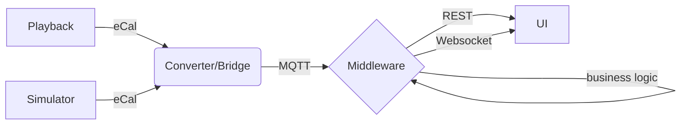

# Team05 

Challenge see https://github.com/Eclipse-SDV-Hackathon-BCX/hackchallenge-hack-the-truck

## Goal: provide insights into parking situations for trucks along highways

## Architecture

## Components

### Simulator (sim)

Publish additional/simulated data as ecal needed for interpretation

Telemetry:
- GPS coordinates (lat, long)
- Speed
- Accelerator / Gas pedal
- Brake pedal

Output:
- eCal data

### Converter (conv)

Subscribes to eCal topic, forwards via MQTT broker

### Middleware (mw)

Subscribes to MQTT broker, gives access to data for highway stop status

### UI (ui)

Display data for highway stops